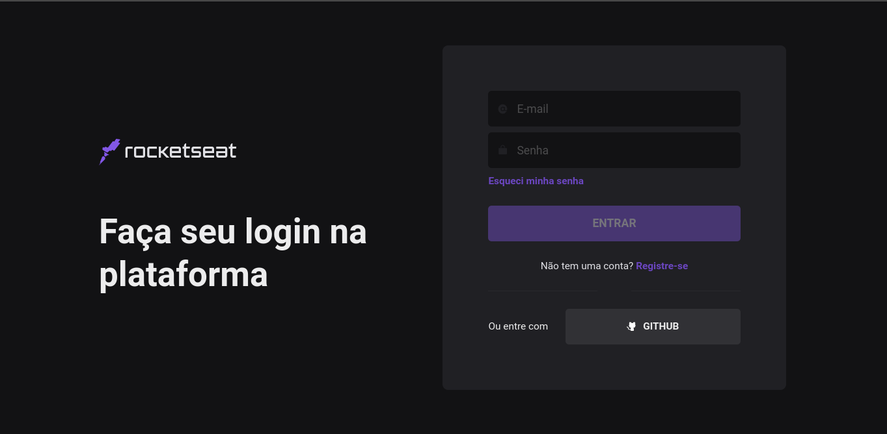

# Rocketseat login page clone

---

Um clone da página de login da plataforma de cursos Rocketseat.

Este projeto foi desenvolvido com o intuito de adquirir conhecimentos e prática em [Nextjs](https://nextjs.org/).

Para os elementos de interface de usuário foi utilizada a biblioteca [ChakraUi](https://chakra-ui.com/)

Para a realização dos elementos iniciais desta página foi utilizado como guia o vídeo [Aplicações React do futuro? UI declarativas, design system e frameworks | Code/Drops #48
](https://www.youtube.com/watch?v=6TEo2AxW-oQ) Do canal de youtube da própria plataforma da rocketseat.

Porém foram realizadas algumas alterações de estilo, foram adicionados os ícones da biblioteca [phosphor icons](https://phosphoricons.com/) e também foram adicionadas funções interativas para a página, como a chamada de uma API ficticia utilizando os próprios recursos fornecidos pelo next. Uma validação para habilitar o botão de login apenas quando os respectivos campos forem preenchidos, e a chamada de rota ser realizada apenas quando todos os parâmetros necessários para a rota forem preenchidos corretamente
